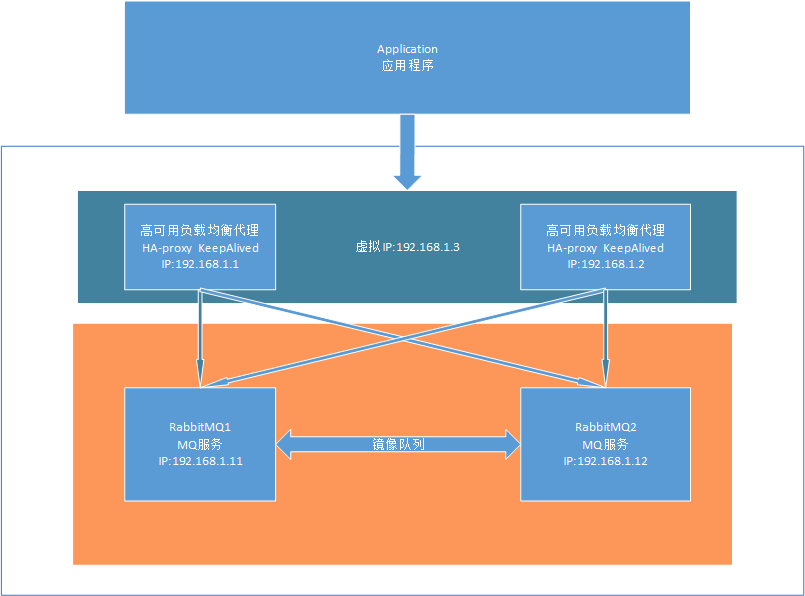

# RabbitMQ 集群

## 概述

### RabbitMQ镜像队列模式集群：

* RabbitMQ集群模式非常经典的就是Mirror镜像模式，节点足够的情况下能保证100%数据不丢失，在实际工作中也是用的最多的。并且实现集群非常的简单，一般互联网大厂都会构建这种镜像集群模式
* Mirror镜像队列，目的是为了保证rabbitmq数据的高可靠性解决方案，主要就是实现数据的同步，一般来讲是2-3个节点实现数据同步（对于100%数据可靠性解决方案一般是3节点以上）

在本文中将要搭建的RabbitMQ集群架构如下：



## RabbitMQ集群节点说明：

| 机器IP       | hostname  | 节点说明        | 端口 |
| ------------ | --------- | --------------- | ---- |
| 10.171.48.28 | rabbitmq1 | RabbitMQ Master | 5672 |
| 10.171.48.29 | rabbitmq2 | RabbitMQ Slave  | 5672 |

这几台机器的`hosts`文件均需配置IP与`hostname`的映射关系,配置后最好重启机器,确认主机的hostname已修改，如下：

```bash
$ cat /etc/hosts
10.171.48.28 rabbitmq1
10.171.48.29 rabbitmq02
```

## 配置集群

### 停止

首先，需要将这几个节点的RabbitMQ服务都停止，执行如下命令：

```bash
rabbitmqctl stop_app
```

### 配置主节点

这里我将`10.171.48.28`这个节点作为Master角色，把Master节点的`.erlang.cookie`文件拷贝到其他机器上：

```bash
scp /var/lib/rabbitmq/.erlang.cookie 10.171.48.29:/var/lib/rabbitmq/
```

### 配置所有节点为独立模式

```b
rabbitmq-server -detached
```

### 启动主节点

```bash
rabbitmqctl start_app
```

### 从节点加入集群

在`10.171.48.29`上执行如下：

```bash
rabbitmqctl join_cluster rabbit@rabbitmq1
```

**Tips** 

* 注意两台机器的防火墙策略，要开放的端口为：5672、15672、25672、4369

* 如果想让加入集群中的节点是以内存方式存储数据，则需要加上`--ram`参数，否则默认是磁盘存储

完成以上步骤后，此时集群就已经搭建起来了，可以使用如下命令查看集群状态信息：

```bash
 rabbitmqctl cluster_status
```

我们可以使用如下命令修改集群名称（默认为第一个节点的名称）：

```bash
rabbitmqctl set_cluster_name dev_rabbitmq_cluster
```

如果以后需要移除集群中的节点可以在master节点上使用如下命令：

```bash
rabbitmqctl forget_cluster_node rabbit@rabbitmq02
```

## 镜像队列

经过以上步骤搭建好普通集群后，此时集群中的节点还是会各自存储各自的数据，数据不会在多个节点中冗余存储，这样其中一个节点挂掉了，那么该节点的数据就无法被消费了。

所以接下来我们还需要配置集群模式为镜像队列模式，将所有队列设置为镜像队列后，队列才会被复制到各个节点上，让各个节点状态保持一致。设置镜像队列策略的命令如下（在任意一个节点上执行）：

```bash
 rabbitmqctl set_policy ha-all "^" '{"ha-mode":"all"}'
```

